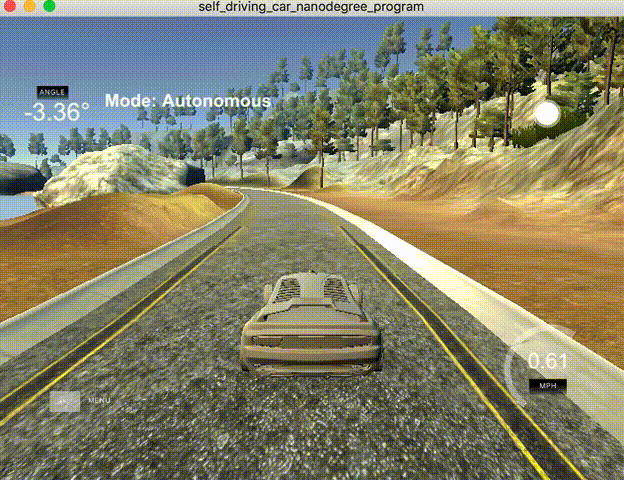

Self Driving Car Engineer Nanodegree
====================================

### About

This repository contains projects associated with Udacity's [Self Driving Car Engineer Nanodegree](https://www.udacity.com/course/self-driving-car-engineer-nanodegree--nd013).

### Term 1

#### [Finding Lane Lines](https://github.com/moisesvw/carnd/tree/master/finding-lanelines)

Detected highway lane lines on a video stream. Used OpencV image analysis techniques to identify lines, including Hough Transforms and Canny edge detection.

[image3]: ./finding-lanelines/examples/image_2.jpg "solidYellowCurve"
![alt text][image3]

#### [Traffic Sign Classifier](https://github.com/moisesvw/Traffic-Sign-Recognition)

Built and trained a deep neural network to classify traffic signs, using TensorFlow. Experimented with different network architectures. Performed image pre-processing and validation to guard against overfitting.

#### [Behavioral Cloning](https://github.com/moisesvw/carnd/tree/master/behavioral-cloning)

Built and trained a convolutional neural network for end-to-end driving in a simulator, using TensorFlow and Keras. Used optimization techniques such as regularization and dropout to generalize the network for driving on multiple tracks.

#### [Advance Lane Finding](https://github.com/moisesvw/carnd/tree/master/advance-lane-lines)

Built an advanced lane-finding algorithm using distortion correction, image rectification, color transforms, and gradient thresholding. Identified lane curvature and vehicle displacement. Overcame environmental challenges such as shadows and pavement changes.

#### [Vehicle Detection And Tracking](https://github.com/moisesvw/carnd/tree/master/vehicle-detection-svm-master)

Created a vehicle detection and tracking pipeline with OpenCV, histogram of oriented gradients (HOG), and support vector machines (SVM). Optimized and evaluated the model on video data from a automotive camera taken during highway driving.

### Term 2

#### [Extended Kalman Filter](https://github.com/moisesvw/extended_kalman_filter2D)

Implemented an Extended Kalman Filter algorithm in C++ capable of tracking a pedestrian's motion in two dimensions.

#### [Unscented Kalman Filter](https://github.com/moisesvw/carnd/tree/master/unscented-kalman-filter)

Implemented an Unscented Kalman Filter algorithm in C++ capable of accurately and performantly tracking a turning object.

#### [Kidnapped Vehicle](https://github.com/moisesvw/carnd/tree/master/kidnapped-vehicle)

Implemented a 2 dimensional particle filter in C++ capable of localizing a vehicle within desired accuracy and time.

#### [PID Controller](https://github.com/moisesvw/carnd/tree/master/pid-control)
Implemented a PID controller in C++ to maneuver a vehicle around a track.

#### [Model Predictive Control](https://github.com/moisesvw/carnd/tree/master/mpc)

Implemented Model Predictive Control to drive a vehicle around a track even with additional latency between commands.

