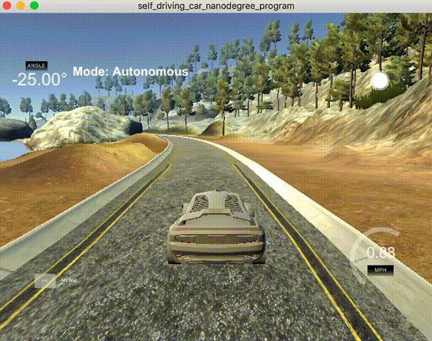
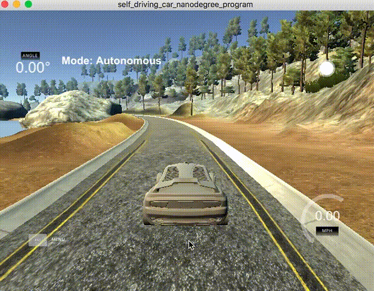
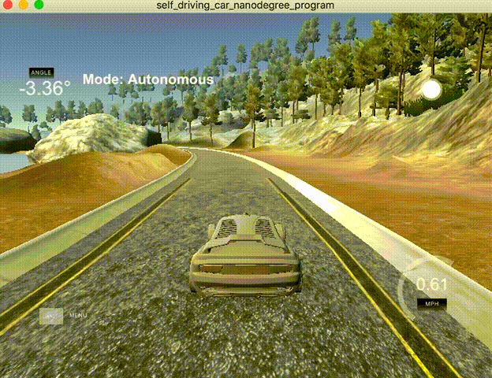

# CarND-Controls-PID
Self-Driving Car Engineer Nanodegree Program

---

### WriteUp

This project use Proportional (P), Integral (I) and Derivative (D) factor of Cross Track Error (CTE)
to steer the direction of a car by calculating the steering angle base on these factors. CTE it is the
error distance between the reference trajectory and the actual trajectory of the car. Next paragraphs
are intended to explain how this factors are implemented in this project and how affects the car
trajectory.

The steering angles are between -25 degrees and 25 Degrees and are equivalent in Radians to -0.436332 and 0.436332.
what P,I and D factors are produce steering angles that minimize the CTE over the reference trajectory.

The image above shows how the car is steering only with the P value in this case P=0.2, it will make
the car oscillate in the road around the trajectory reference as the image shows, when the car starts the CTE is small and the resulting angle
will be small but it will increase as the error increases making the car oscillate.



Adding the Integral part with an small value of I=0.00001, since this factor is multiplied by the sumatary
across all CTE's values and is added to the P having an I factor with greater number will make the angles
more prone to obtain big values os steering making it oscillate even  more.



Finally adding the Derivative part with factor of 1.7 helps to stabilize the angles and the CTE's values to be near of the
trajectory of reference.



To find out the the values por PID respectively, first I’ve tried with with Gaussian distribution with
mean 0.0 and variance of 10 degrees, this was a good start to see how the drawn angles values reflect 
on the car steering. Next step was implement Twiddle algorithm and integrate it with the measurements
work flow, it did not work quite well I’ve printed some results below, but I could not find a easy way
to make this parameter search with twiddle last more frames in the simulator.

Finally opted to tune the parameters manually similar to how the Twiddle process does.
I’ve started with all P, I and D values on 0.0, then  start with P variable and increase
it by a little and see how it behaves on the simulator, more increased P values more the car
starts to oscillate, then put P in low value 0.2. When I’ve started to increase the 
I noted that the angle of steering start to increase linearly and decided to put it
to small value of 0.0001 and continue with D value. D value was key to make this work increase
D value stabilize the steering to avoid oscillations. the final value where

P=0.2,  I=0.00001, and D=1.7, with this parameters make the entire track.

```
Twiddle Results:

P: 0.0331, I: 0.0331, D: 0.0331
EP: 0.01331, EI: 0.01331, ED: 0.01331
CTE: 0.7597 Steering Value: -0.286745
42["steer",{"steering_angle":-0.286744857,"throttle":0.3}]


Iteration 11, best error = -0.286745
INdex: 1<-----------

P: 0.04641, I: 0.0331, D: 0.0331
EP: 0.014641, EI: 0.01331, ED: 0.01331
CTE: 0.7592 Steering Value: -0.423071
42["steer",{"steering_angle":-0.423070933,"throttle":0.3}]


Iteration 12, best error = -0.423071
INdex: 2<-----------

P: 0.04641, I: 0.04641, D: 0.0331
EP: 0.014641, EI: 0.014641, ED: 0.01331
CTE: 0.7588 Steering Value: -0.458266
42["steer",{"steering_angle":-0.458266263,"throttle":0.3}]


Iteration 13, best error = -0.458266
INdex: 0<-----------

P: 0.04641, I: 0.04641, D: 0.04641
EP: 0.014641, EI: 0.014641, ED: 0.014641
CTE: 0.758 Steering Value: -0.504487
42["steer",{"steering_angle":-0.504487229,"throttle":0.3}]
```

## Dependencies

* cmake >= 3.5
 * All OSes: [click here for installation instructions](https://cmake.org/install/)
* make >= 4.1(mac, linux), 3.81(Windows)
  * Linux: make is installed by default on most Linux distros
  * Mac: [install Xcode command line tools to get make](https://developer.apple.com/xcode/features/)
  * Windows: [Click here for installation instructions](http://gnuwin32.sourceforge.net/packages/make.htm)
* gcc/g++ >= 5.4
  * Linux: gcc / g++ is installed by default on most Linux distros
  * Mac: same deal as make - [install Xcode command line tools]((https://developer.apple.com/xcode/features/)
  * Windows: recommend using [MinGW](http://www.mingw.org/)
* [uWebSockets](https://github.com/uWebSockets/uWebSockets)
  * Run either `./install-mac.sh` or `./install-ubuntu.sh`.
  * If you install from source, checkout to commit `e94b6e1`, i.e.
    ```
    git clone https://github.com/uWebSockets/uWebSockets 
    cd uWebSockets
    git checkout e94b6e1
    ```
    Some function signatures have changed in v0.14.x. See [this PR](https://github.com/udacity/CarND-MPC-Project/pull/3) for more details.
* Simulator. You can download these from the [project intro page](https://github.com/udacity/self-driving-car-sim/releases) in the classroom.

There's an experimental patch for windows in this [PR](https://github.com/udacity/CarND-PID-Control-Project/pull/3)

## Basic Build Instructions

1. Clone this repo.
2. Make a build directory: `mkdir build && cd build`
3. Compile: `cmake .. && make`
4. Run it: `./pid`. 

Tips for setting up your environment can be found [here](https://classroom.udacity.com/nanodegrees/nd013/parts/40f38239-66b6-46ec-ae68-03afd8a601c8/modules/0949fca6-b379-42af-a919-ee50aa304e6a/lessons/f758c44c-5e40-4e01-93b5-1a82aa4e044f/concepts/23d376c7-0195-4276-bdf0-e02f1f3c665d)

## Editor Settings

We've purposefully kept editor configuration files out of this repo in order to
keep it as simple and environment agnostic as possible. However, we recommend
using the following settings:

* indent using spaces
* set tab width to 2 spaces (keeps the matrices in source code aligned)

## Code Style

Please (do your best to) stick to [Google's C++ style guide](https://google.github.io/styleguide/cppguide.html).

## Project Instructions and Rubric

Note: regardless of the changes you make, your project must be buildable using
cmake and make!

More information is only accessible by people who are already enrolled in Term 2
of CarND. If you are enrolled, see [the project page](https://classroom.udacity.com/nanodegrees/nd013/parts/40f38239-66b6-46ec-ae68-03afd8a601c8/modules/f1820894-8322-4bb3-81aa-b26b3c6dcbaf/lessons/e8235395-22dd-4b87-88e0-d108c5e5bbf4/concepts/6a4d8d42-6a04-4aa6-b284-1697c0fd6562)
for instructions and the project rubric.
