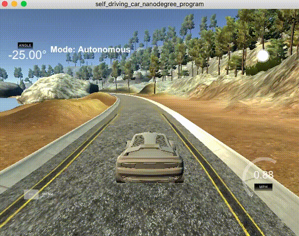
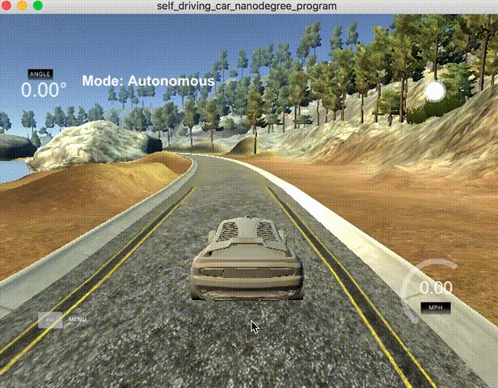

# WriteUp

This project use Proportional (P), Integral (I) and Derivative (D) factor of Cross Track Error (CTE)
to steer the direction of a car by calculating the steering angle base on these factors. CTE it is the
error distance between the reference trajectory and the actual trajectory of the car. Next paragraphs
are intended to explain how this factors are implemented in this project and how affects the car
trajectory.

The steering angles are between -25 degrees and 25 Degrees and are equivalent in Radians to -0.436332 and 0.436332.
what P,I and D factors are produce steering angles that minimize the CTE over the reference trajectory.

The image above shows how the car is steering only with the P value in this case P=0.2, it will make
the car oscillate in the road around the trajectory reference as the image shows, when the car starts the CTE is small and the resulting angle
will be small but it will increase as the error increases making the car oscillate.

Adding the Integral part with an small value of I=0.00001, since this factor is multiplied by the sumatary
across all CTE's values and is added to the P having an I factor with greater number will make the angles
more prone to obtain big values os steering making it oscillate even  more.

Finally adding the Derivative part with factor of 1.7 helps to stabilize the angles and the CTE's values to be near of the
trajectory of reference.

To find out the the values por PID respectively, first I’ve tried with with Gaussian distribution with
mean 0.0 and variance of 10 degrees, this was a good start to see how the drawn angles values reflect 
on the car steering. Next step was implement Twiddle algorithm and integrate it with the measurements
work flow, it did not work quite well I’ve printed some results below, but I could not find a easy way
to make this parameter search with twiddle last more frames in the simulator.

Finally opted to tune the parameters manually similar to how the Twiddle process does.
I’ve started with all P, I and D values on 0.0, then  start with P variable and increase
it by a little and see how it behaves on the simulator, more increased P values more the car
starts to oscillate, then put P in low value 0.2. When I’ve started to increase the 
I noted that the angle of steering start to increase linearly and decided to put it
to small value of 0.0001 and continue with D value. D value was key to make this work increase
D value stabilize the steering to avoid oscillations. the final value where

P=0.2,  I=0.00001, and D=1.7, with this parameters make the entire track.

Twiddle Results:

P: 0.0331, I: 0.0331, D: 0.0331
EP: 0.01331, EI: 0.01331, ED: 0.01331
CTE: 0.7597 Steering Value: -0.286745
42["steer",{"steering_angle":-0.286744857,"throttle":0.3}]

Iteration 11, best error = -0.286745
INdex: 1<-----------

P: 0.04641, I: 0.0331, D: 0.0331
EP: 0.014641, EI: 0.01331, ED: 0.01331
CTE: 0.7592 Steering Value: -0.423071
42["steer",{"steering_angle":-0.423070933,"throttle":0.3}]

Iteration 12, best error = -0.423071
INdex: 2<-----------

P: 0.04641, I: 0.04641, D: 0.0331
EP: 0.014641, EI: 0.014641, ED: 0.01331
CTE: 0.7588 Steering Value: -0.458266
42["steer",{"steering_angle":-0.458266263,"throttle":0.3}]

Iteration 13, best error = -0.458266
INdex: 0<-----------

P: 0.04641, I: 0.04641, D: 0.04641
EP: 0.014641, EI: 0.014641, ED: 0.014641
CTE: 0.758 Steering Value: -0.504487
42["steer",{"steering_angle":-0.504487229,"throttle":0.3}]
